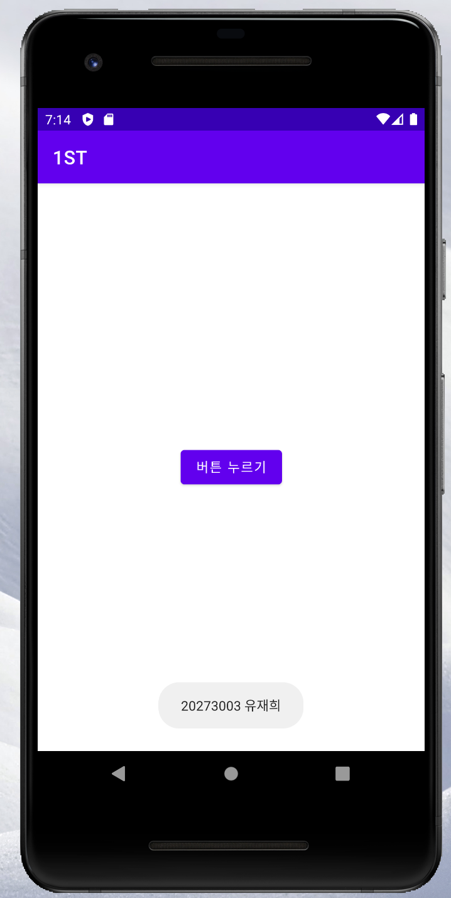
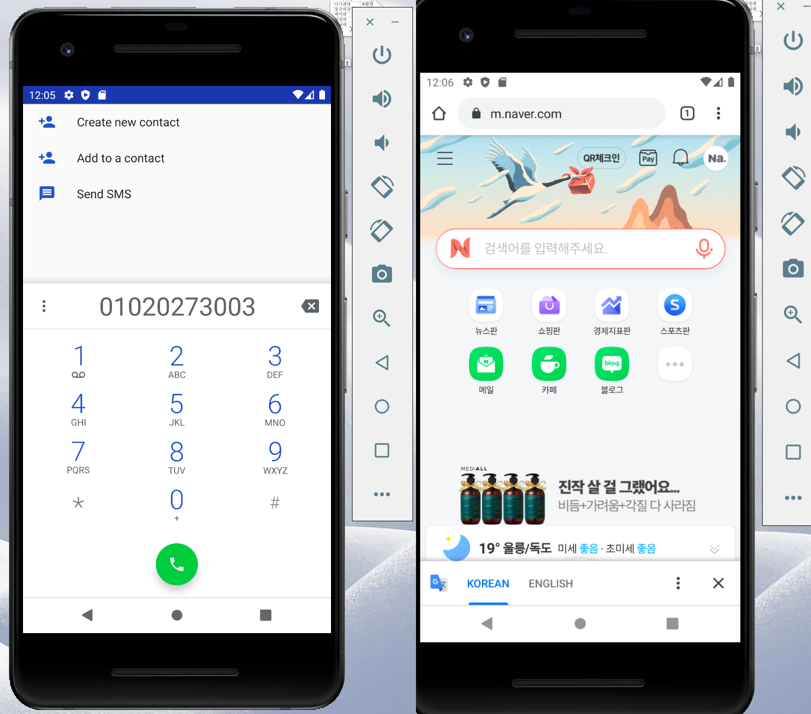
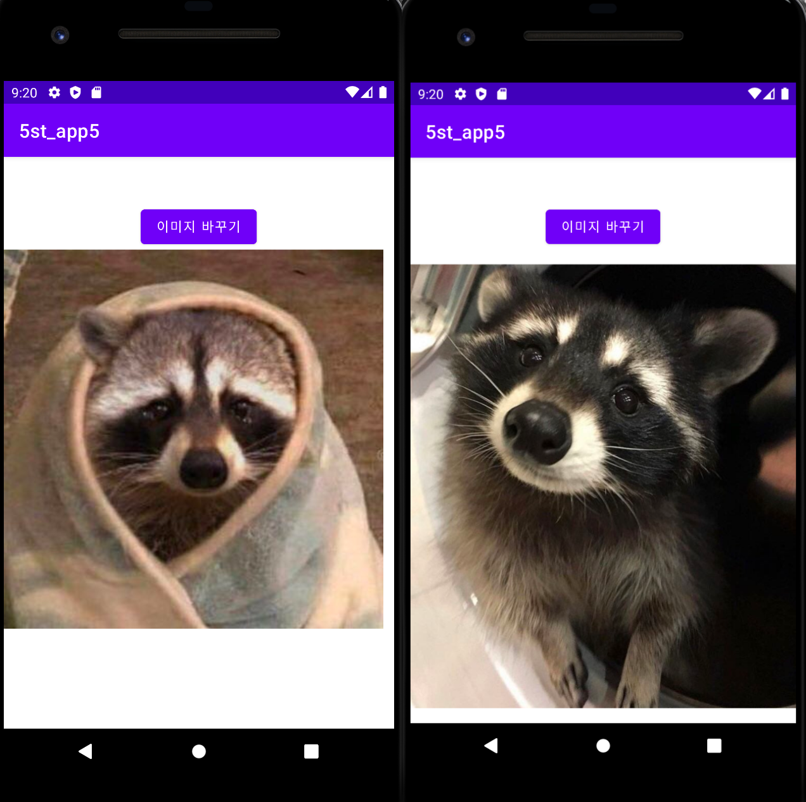
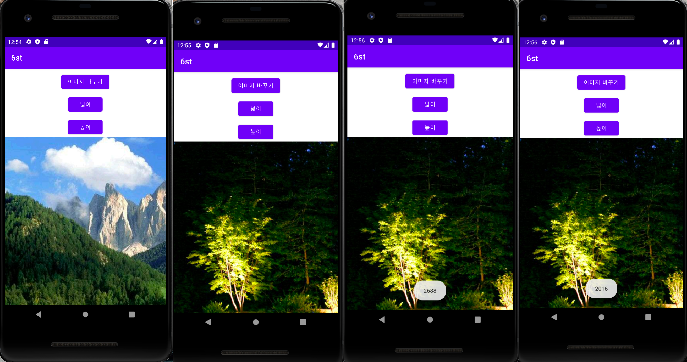
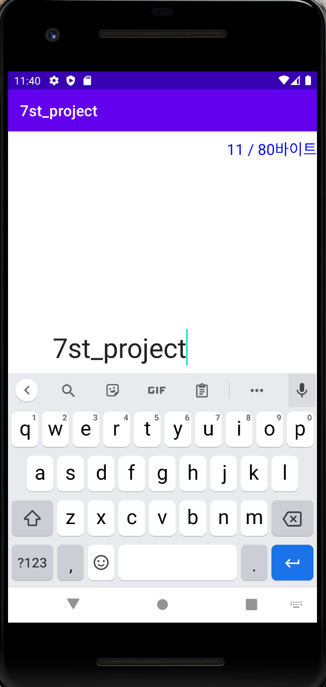

# 2021-2 캡스톤 디자인 수업

## 2주차
</img>
  - 과제
  
  </img>

## 3주차
  - 과제
  
  </img>

## 4주차
  - 각자의 체형, 스타일에 맞게 코디해주는 어플
  
    키, 몸무게, 체형, 원하는 스타일 등을 설정하면 상황별로 다양한 코디를 보여준다.
    
    코디앱과 온라인쇼핑몰을 합쳐 코디된 상품을 바로 구매할 수 있다.

## 5주차
  - 과제

</img>

## 6주차
  - 과제

</img>

## 7주차
  - 과제

</img>

## 10주차
  -과제
  
 
 </img>
